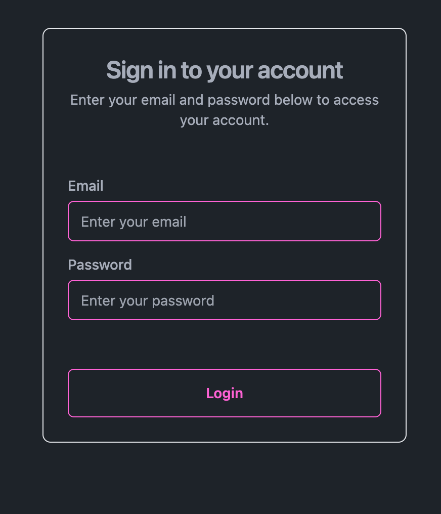
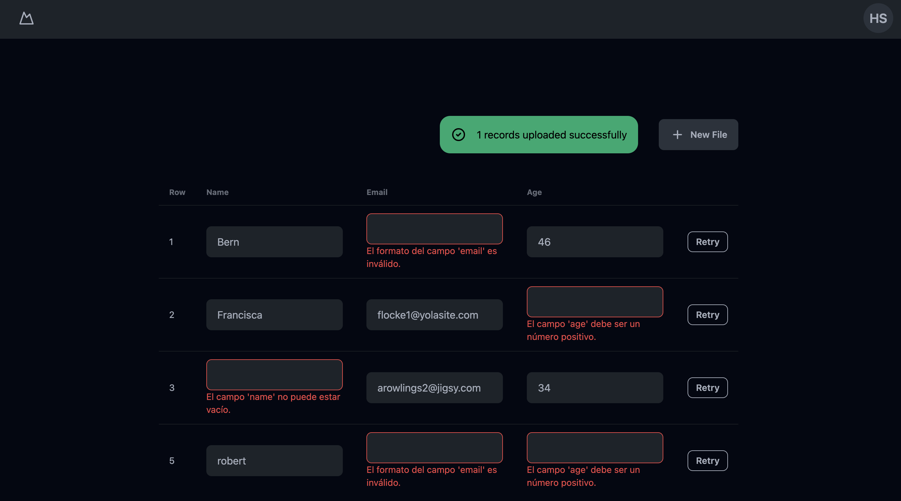

# Secure Data Loader


`secure-data-loader-fronted` es el frontend de la aplicación Secure Data Loader que proporciona una interfaz de usuario para la autenticación, carga de archivos CSV y gestión de datos. Este frontend se comunica con el backend (secure-data-loader-api) para realizar operaciones CRUD y manejar archivos CSV.

## Tabla de Contenidos

- [Características](#caracteristicas)
- [Instalación](#instalación)
- [Estructura del proyecto](#estructuradelproyecto)
- [Producción](producción)

## Características

- Autenticación de Usuarios: Permite a los usuarios iniciar y cerrar sesión.
- Rutas Protegidas: Solo permite el acceso a usuarios autenticados.
- Interfaz de Usuario Atractiva: Utiliza Tailwind CSS y DaisyUI para estilos modernos y responsivos.
- Gestión de Estado y Contexto: Usa el Context API de React para manejar el estado de autenticación.


## Instalación

### Pasos

1. Clona el repositorio:

    ```bash
    git clone https://github.com/HillarySLL/secure-data-loader.git
    cd secure-data-loader
    ```

2. Instala las dependencias:

    ```bash
    npm install
    ```

3. Configura las variables de entorno:

    Crea un archivo `.env` en la raíz del proyecto y añade las siguiente variable:

    ```env
    VITE_API_URL="http://localhost:5500"
    ```

### Desarrollo

Para iniciar la aplicación en modo desarrollo:


```bash
npm run dev
```

## Estructura del Proyecto

1. App.jsx:

    Componente principal que define las rutas y estructura general de la aplicación.

    Librerías Utilizadas: react, react-router-dom, AuthProvider (contexto de autenticación), ProtectedRoute.

2. Login.jsx:

    Muestra un formulario para que los usuarios ingresen su correo electrónico y contraseña, maneja el envío del formulario, y navega a la página de carga si la autenticación es exitosa.

    Librerías Utilizadas: react, react-router-dom, useAuth (hook de contexto de autenticación).

    

3. Upload.jsx:

   Muestra un formulario para que los usuarios seleccionen y suban un archivo CSV, y maneja la carga del archivo a la API.

    Librerías Utilizadas: react, react-router-dom.

    Proporciona una barra de navegación con una opción de cierre de sesión.

     22.35.13.png>)

4. Records.jsx:

    Muestra una tabla con los registros, permite a los usuarios editar y reintentar la carga de registros con errores.

    Librerías Utilizadas: react, react-router-dom.

    Proporciona una barra de navegación con una opción de cierre de sesión.

      
## Producción
https://secure-data-loader.onrender.com
